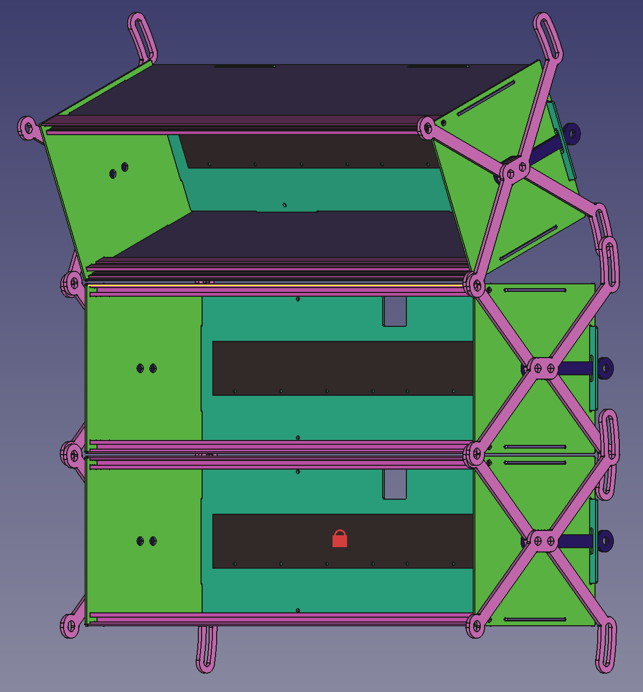
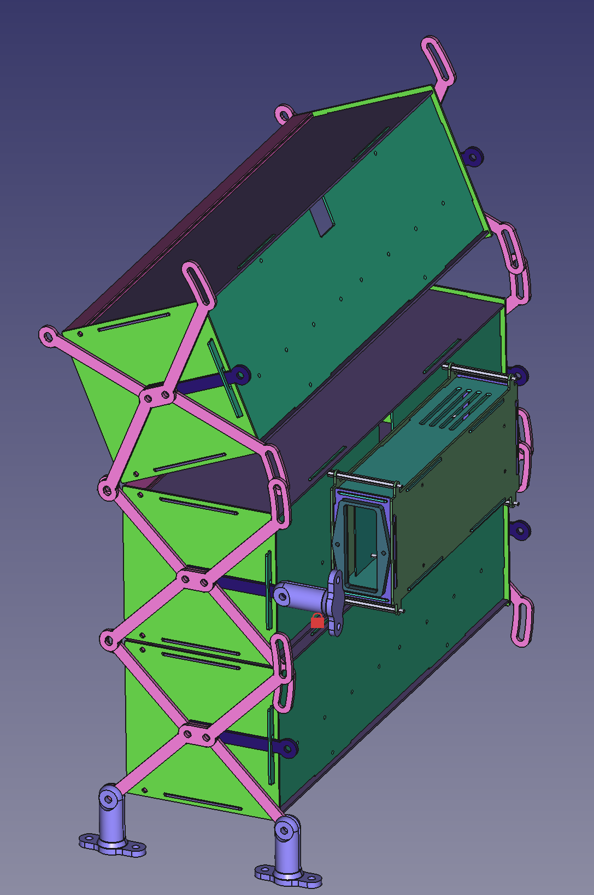

# loowit

An adjustable-curve, modular eurorack enclosure.

See my [blog post](https://rgb.sh/blog/loowit) for more details on the design.

## Bill of Materials

- *Row*
    - *Enclosure*
        - 2x Side Panel
        - 2x Top/Bottom Panel
        - 1x Back Panel
        - 2x 84HP [Tiptop Z-Rails](https://tiptopaudio.com/z-rails/)
        - 4x M4x16mm Screws
    - *Bus Board (optional)*
        - 1x [Doepfer Bus Board V6](https://doepfer.de/a100z_e.htm)
        - 8x M3x6+6 Standoffs
        - 8x M3x5 Screws
        - 8x M3x0.5 Nuts
    - *Frame*
        - 4x Bracket
        - 2x Spacer
        - 4x M6x20 Flange Screws
        - 4x M6x6 Flange Nuts
- *Row Connection*
    - 4x M6x20 Flange Screws
    - 4x M6x6 Flange Nuts
- *Power Supply (optional)*
    - *Electrical*
        - 1x [Doepfer PSU3](https://www2.doepfer.eu/en/item/doepfer-a100psu3)
            - Includes compatible mounting hardware
        - 1x [Qualtek 764-00/002 Power Entry](https://www.qualtekusa.com/product/764-00-002/)
            - 2x 5x20mm Time Lag Fuses (see *Doepfer PSU3 Manual*)
            - 2x M3x8mm Countersunk Screws
            - 2x M3x0.5 Nuts
        - *AC/Input Wire (lengths & colors vary)*
        - *DC/Input Wire (lengths & colors vary)*
        - *Wire terminals*
    - *Enclosure*
        - 2x Top/Bottom
        - 2x Side (short)
        - 2x Side (long)
        - 4x M3x50+6 Standoffs
        - 4x M3x5 Screws
    - *Attachment*
        - 4x M3x10+6 Standoffs (for M3x50+6 male)
        - 4x M3x0.5 Nuts
- *Mounting, for external L-frame (optional)*
    - 4x 3D Printed Mount
    - 4x M6x20 Flange Screws
    - 4x M6x6 Flange Nuts

## References

### Schematics

- [Doepfer A-100 Construction Details (Eurorack Physical Specs)](https://doepfer.de/a100_man/a100m_e.htm)
- [Doepfer Busboard V6](https://doepfer.de/service/A100_busboard_measures.pdf)
- [Doepfer PSU3](https://doepfer.de/service/A100_PSU3_measures.pdf)
- [Qualtek 764-00/002](https://www.qualtekusa.com/wp-content/uploads/specsheets/76400002.pdf)
- [Tiptop Z-Rails](https://www.tiptopaudio.com/manuals/Tiptop_Audio_z-rails_data_sheet.pdf)

### Wiring

- [Doepfer PSU3 Manual](https://doepfer.de/a100_man/A100_Netzteil_Hinweise_2020.pdf)
- [Doepfer PSU3 Wiring](https://doepfer.de/a100_man/A100PSU3_wiring.pdf)
