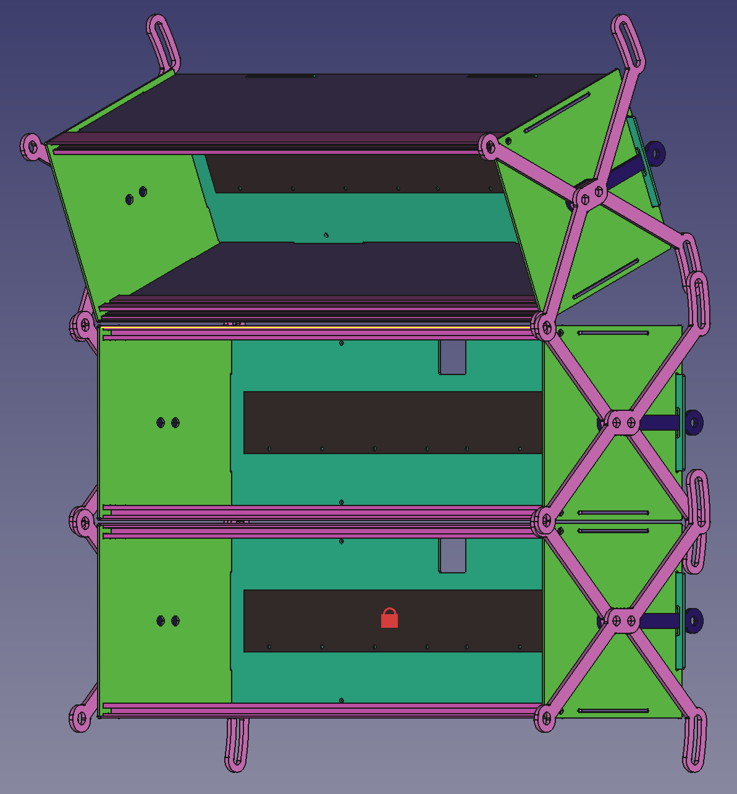

# loowit

An adjustable-curve, modular eurorack enclosure.

## References

### Schematics

- [A-100 Analog Modular System - Accessories and Spare Parts](https://doepfer.de/a100z_e.htm)
    - [Busboard Measures](https://doepfer.de/service/A100_busboard_measures.pdf)
    - [PSU3 Measures](https://doepfer.de/service/A100_PSU3_measures.pdf)
- [A-100 Construction Details](https://doepfer.de/a100_man/a100m_e.htm)
    - [Front Plate](https://doepfer.de/a100_man/A100FP.gif)
- [Qualtek 764-00/002](https://www.qualtekusa.com/product/764-00-002/)
    - [Product Datasheet](https://www.qualtekusa.com/wp-content/uploads/specsheets/76400002.pdf)
- [Tiptop Z-Rails](https://tiptopaudio.com/z-rails/)
    - [Data Sheet](https://www.tiptopaudio.com/manuals/Tiptop_Audio_z-rails_data_sheet.pdf)

### Wiring

- [Doepfer PSU3 Manual](https://doepfer.de/a100_man/A100_Netzteil_Hinweise_2020.pdf)
- [Doepfer PSU3 Wiring](https://doepfer.de/a100_man/A100PSU3_wiring.pdf)
